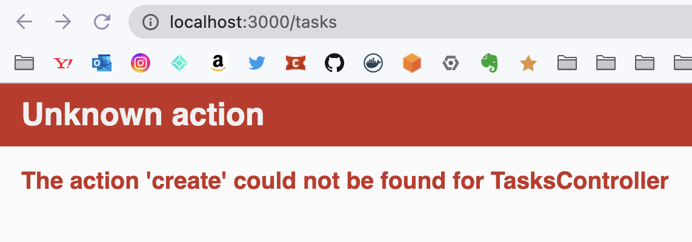

# 疑問

p106. 「登録する」押すと、action createが反応するのは何故か？controllerにも定義していない.  
(routesでresourcesは設定した(pathはある状態))
該当のソースが見つけられない。

```new.html.slim
= form_with model: @task, local: true do |f|
  .form-group
    = f.label :name
    = f.text_field :name, class: 'form-control', id: 'task_name'
  .form-group
    = f.label :description
    = f.text_area :description, rows: 5, class: 'form-control', id: 'task_description'
  = f.submit nil, class: 'btn btn-primary'
```

```tasks_controller.rb
class TasksController < ApplicationController
  def index
  end

  def show
  end

  def new
    @task = Task.new
  end

  def edit
  end
end
```

